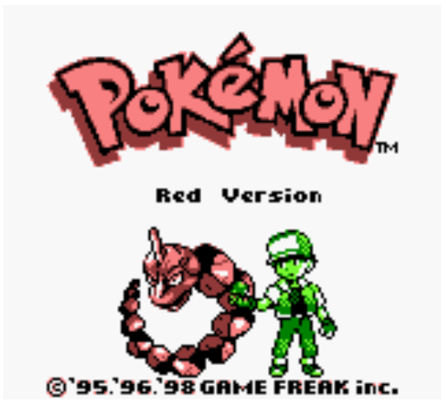

# workshop_reverse

## Goal

In february 2021 the Pokemon game will celebrate its 25th anniversary (Who cares ? It's 2024). To pay an homage to this game series we’ll use our programming skills and more generaly our knowledge about computers to write a simple
save game editor for the Pokemon Red and Blue games on the GameBoy



## Tools needed

For sake of simplicity we’ll write our code in C or in Python3
- The gameboy emulator is provided
- The game rom is provided
- We’ll also use a tool called `vbindiff` and an hexadecimal editor `ghex`` to help us figuring out the save data format of those games.
```
∼/B-INN-000> sudo dnf install vbindiff
```
• An hex file editor
```
∼/B-INN-000> dnf install ghex
```

## Quick intro

A word on how saves works on the original GameBoy.


The gameboy console does not have any “secondary memory” (hard drive, SDD, flash memory).
The only memory avaible to this console is:
- it’s CPU registers and the RAM.
However those are “volatile” memory, that is to say that once the console is turned off, everything stored in RAM and and the CPU’s registers are gone.
- the game ROM (Read Only Memory).
However this as it names implies, this type of memory is Read Only (it’s impossible to write to it, so it’s impossible to save our progression throught the game on it)

But how it is possible to save our progession for those games ?

On certain type of game cartridge it’s possible to find additionnal RAM storage connected to a battery.


Remember RAM is zeroed once the console is turned off. . . but what if we have some RAM connected to a battery permanently ? Yes, it allows us to write data that can be preserved even if the console is switched
off.


When the player wants to save, some values from the Internal RAM are copied to the External Battery Powered RAM.
When the player wants to load a saved game, some data stored in the External Battery Powered RAM are copied in the Internal RAM.

## Save editor

To write a save game editor, we’ll just need to figure out where different data structure are stored in the
External RAM (Player name, amount of money, inventory, party, etc. . . ) and change the values at those
addresses