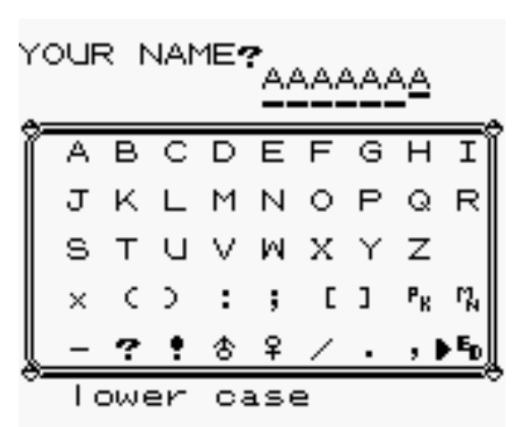
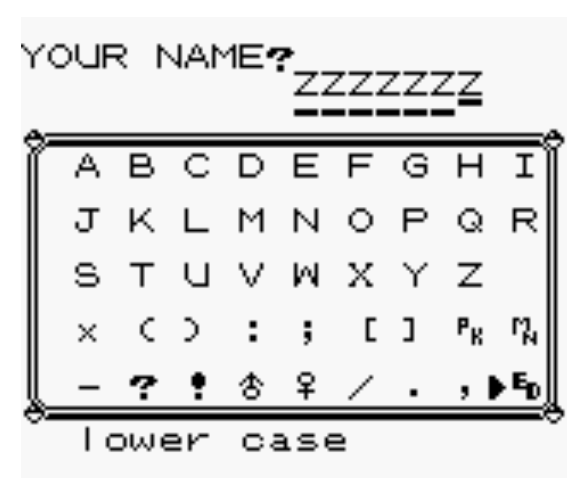

# Step 1: Editing the player's name

## How to find where the player name is stored ?

When you start a new game allows us to pick a new name for the player and the rival.
The maximum lenght of those name is 7 characters.

So if the player is named “AAAAAAA” in one save file and “ZZZZZZZ” in another save file, then by comparing the 2 save files at one point we should find 7 identicals bytes in both files and the difference between
those should be 25 (‘Z’ - ‘A’ = 25)

## Step 1.1: Spot the 7 differences

 Start 2 games:
- In one set the player's name to "AAAAAAA" and in the other set it to "BBBBBBB".
- Save both game
- Open both save file (.sav extension) in `vbindiff`
- Find a relevant difference in the saves, and take note of the location (address) of this difference in the					2590 et 25F0 et 2600 et 2CF0 et 3520

## Step 1.2: Edit the save

Open one the save in an hexeditor:

- Change the player's name to "EPITECH" at the address found in the last step
	- Note: the game seems to use a different character set than ASCII.
		- 'A' in ASCII is 0x41
		- 'A' in the game is something different
- Recalculate the save's checksum via the provided tool
- Start the game with your modified save and check if it worked

## Step 1.3: Write a program to change the name of the player to anything you want.

You may want to use those functions:

- fopen
- fseek
- fwrite
- fclose

(You can also do it in python or any other language)
 
Don't forget to fix the save's checksum before testing with the emulator.
